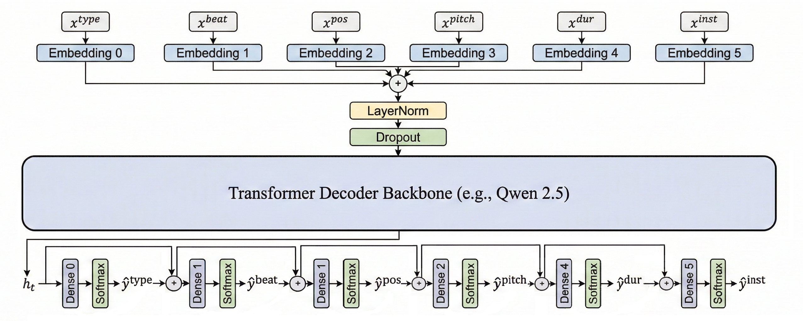

# MusicSLM: Multitrack Music Generation via Adapter-Based Fine-Tuning

MusicSLM is a framework that adapts a Small Language Model (SLM), specifically Qwen2.5-1.5B, for high-quality multitrack symbolic music composition. By using Low-Rank Adaptation (LoRA), the model leverages the sequential reasoning of LLMs while keeping 99% of the parameters frozen.


## Key Features
- Parameter-Efficient Fine-Tuning: Utilizes LoRA to repurpose the latent space of Qwen2.5 for music generation.

- Hierarchical Intra-step Decoding: Overcomes attribute-independence limitations by factorizing musical event prediction into an autoregressive chain (Type → Beat → Position → Pitch → Duration → Instrument).

- Dynamic Logit Masking: Enforces strict musical constraints, such as Temporal Monotonicity (ensuring time only moves forward) and Instrument Validity.

- Compound Word (CP) Representation: Processes multi-attribute musical notes as single timesteps for efficient sequencing.


## Installation

1. Clone the repository:

```Bash
git clone https://github.com/Tuneful13/music_gen.git
cd music_gen
```

2. Install dependencies (ensure you have PyTorch and Hugging Face transformers installed):

```Bash
pip install -r requirements.txt
```

## Training

You can train the model on the Lakh MIDI Dataset (LMD) or the Symbolic Orchestral Database (SOD).
Quick Test

Run a short training session to verify your setup:
```Bash

# Standard test (Qwen2.5-1.5B)
python train.py -g 0 -d lmd --batch_size 1 --max_seq_len 512 --steps 100 --valid_steps 50 -lr 0.00005 --out_dir exp/test_quick

# Lightweight test (Qwen2.5-0.5B)
python train.py -g 0 -d lmd -m "Qwen/Qwen2.5-0.5B" --batch_size 1 --max_seq_len 512 --steps 100 --valid_steps 50 -lr 0.00005 --out_dir exp/test_quick
```

### Full Training (LMD)

To run in the background and save logs:
```Bash
nohup python train.py -g 0 -d lmd --batch_size 2 --max_seq_len 1024 --steps 20000 --valid_steps 1000 -lr 0.00005 --lr_warmup_steps 2000 --early_stopping --early_stopping_tolerance 15 --out_dir exp/qwen_music_v1 > train_output.log 2>&1 &
```

### Full Training (SOD)
```Bash

nohup python train.py -g 0 -d sod --batch_size 8 --out_dir exp/sod_qwen1.5b > train_output.log 2>&1 &
```

## Evaluation

Evaluate the model using objective metrics such as Pitch Class Entropy, Scale Consistency, and Groove Consistency via the MusPy library.
```Bash

python evaluate.py -d lmd -o exp/qwen_music_v1 --temperature 0.8
```